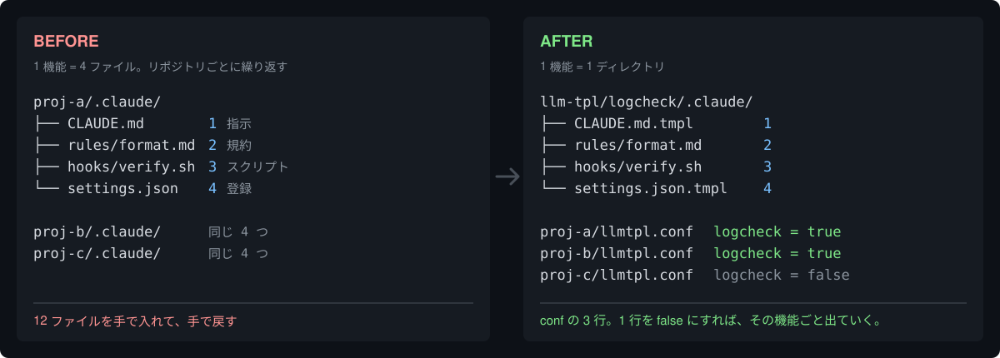

# llmtpl

[](https://github.com/ryokwkm/llmtpl/actions/workflows/ci.yml)
[](https://github.com/ryokwkm/llmtpl/releases)
[](LICENSE)

[English](README.md) | **日本語**

AI エージェントの設定を、機能ごとに ON / OFF する CLI。



llmtpl が扱うのは、**AI コーディングエージェントが読む設定ファイル**——AI への指示・その指示が
指す長い規約・決まったタイミングで走るスクリプト・それを登録する設定。llmtpl は 1 機能に要るものを
**ディレクトリ 1 つ**に畳み、リポジトリ側は 1 行で ON / OFF する。

```ini
logcheck = true
```

この 1 行で、指示も規約もスクリプトも登録もまとめて入る。`false` に変えればまとめて消える ——
手で戻すものは残らない。

## インストール

```sh
brew install ryokwkm/tap/llmtpl
```

[Releases](https://github.com/ryokwkm/llmtpl/releases) からバイナリを落としてもよい。Go があるなら:

```sh
go install github.com/ryokwkm/llmtpl@latest   # 要 Go 1.24+
```

ソースから入れる場合は `make build`（`./llmtpl` へ出力）。
`make install` は `~/.local/bin` へ配置し zsh 補完も置く（macOS / zsh 前提）。
補完は `llmtpl completion zsh|bash|fish` で個別に出せる。

## 動かして見る

以下はそのままコピーして動く（出力も実測値）。この README は「使い始めるまで」を扱う。
仕様の細部と、その仕様になっている理由は [docs/reference.ja.md](docs/reference.ja.md) にある。


### 置く — 1 機能ぶんを、1 つのディレクトリに入れる

機能 1 個ぶんのディレクトリを**バンドル**、受け取る側を**ターゲット**と呼ぶ。覚える言葉はこの 2 つだけ。
`logcheck` というディレクトリ名がそのままフラグ名になる —— フラグ一覧をどこかに登録する作業は無く、
ディレクトリを作れば、その名前のフラグが生まれる。

```
demo/
├── llm-tpl/                        ← バンドル置き場（機能のかたまりを並べる場所）
│   └── logcheck/                   ← ★ ディレクトリ名がそのままフラグ名
│       └── .claude/                   中は受け取る側と同じ形
│           ├── CLAUDE.md.tmpl      ① AI への指示
│           ├── rules/format.md     ② 規約ファイル
│           ├── hooks/verify.sh     ③ スクリプト
│           └── settings.json.tmpl  ④ hook の登録
└── proj/                           ← 設定を受け取るプロジェクト
    ├── llmtpl.conf                    logcheck = true
    └── .claude/
        ├── CLAUDE.md.tmpl             proj 固有の指示（断片を受け取るベース）
        └── settings.json.tmpl         proj 固有の設定（断片を受け取るベース）
```

<details>
<summary><b>この形を作るコマンド</b> —— コピペして動かしてもよいし、読み飛ばしてもよい</summary>

```sh
mkdir -p demo/llm-tpl/logcheck/.claude/rules demo/llm-tpl/logcheck/.claude/hooks demo/proj/.claude
cd demo

# バンドル側 —— ① AI への指示（差し込まれる断片。拡張子は .tmpl だが中身はただの Markdown でよい）
cat > llm-tpl/logcheck/.claude/CLAUDE.md.tmpl <<'EOF'

## 作業ログの検証

- 作業を終えたら `log/` の書式を検証する。規約は `.claude/rules/logcheck/format.md`。
- 手で確かめるときは `.claude/hooks/verify.sh` を実行する。
EOF

# ② 規約と ③ スクリプト（そのまま配られるだけなので、中身は何でもよい）
echo '- 各行は日時から始める。' > llm-tpl/logcheck/.claude/rules/format.md
printf '#!/bin/sh\necho ok\n' > llm-tpl/logcheck/.claude/hooks/verify.sh

# ④ hook の登録（settings.json へ deep merge される断片）
cat > llm-tpl/logcheck/.claude/settings.json.tmpl <<'EOF'
{
  "hooks": {
    "Stop": [
      { "hooks": [{ "type": "command", "command": "$CLAUDE_PROJECT_DIR/.claude/hooks/verify.sh" }] }
    ]
  }
}
EOF

# ターゲット側 —— conf 1 行と、プロジェクト固有の内容だけを書いたベース 2 つ
printf 'logcheck = true\n' > proj/llmtpl.conf
printf '# proj のAI指示\n\n- Go で書く。\n' > proj/.claude/CLAUDE.md.tmpl
printf '{"model": "opus"}\n' > proj/.claude/settings.json.tmpl
```

</details>

### ON にする

```console
$ cd proj && llmtpl apply

バンドルルート: /path/to/demo/llm-tpl（親探索）
▸ proj  [ON: logcheck]
  ✅ 生成 .claude/CLAUDE.md
  ✅ 生成 .claude/settings.json
  🔗 リンク .claude/hooks/verify.sh -> ../../../llm-tpl/logcheck/.claude/hooks/verify.sh
  🔗 リンク .claude/rules/logcheck -> ../../../llm-tpl/logcheck/.claude/rules
```

叩く場所は**自分のプロジェクトの中**（既定は cwd とその配下）。バンドル置き場は親を辿って
自動で見つかるので、場所を渡す必要はない。先に `llmtpl apply --dry-run` を叩けば、書き込まずに
予定だけ見られる。

4 つとも入った。生成された `CLAUDE.md` は、ベースの後ろにバンドルの指示が足された形になる
（1 行目は llmtpl が入れる生成マーカ）。

```markdown
<!-- GENERATED — do not edit directly. Source: proj/.claude/CLAUDE.md.tmpl (edit the source, then run llmtpl apply) -->
# proj のAI指示

- Go で書く。

## 作業ログの検証

- 作業を終えたら `log/` の書式を検証する。規約は `.claude/rules/logcheck/format.md`。
- 手で確かめるときは `.claude/hooks/verify.sh` を実行する。
```

`settings.json` は、ターゲット自身の `model` とバンドルの `hooks` が 1 つの JSON にマージされる。
**キーの重なりを解いて混ぜるのが、symlink では代われない部分**だ。

```json
{
  "hooks": {
    "Stop": [
      {
        "hooks": [
          {
            "command": "$CLAUDE_PROJECT_DIR/.claude/hooks/verify.sh",
            "type": "command"
          }
        ]
      }
    ]
  },
  "model": "opus"
}
```

`rules/` と `hooks/` は相対 symlink。実体はバンドル側に 1 つあるだけで、コピーは増えない。

いま起きたことを整理すると、同じ 1 つのディレクトリから **3 通りの届き方**をしている。
`.md` は文章として連結、`.json` は構造としてマージ、ディレクトリ・スクリプトは symlink。
**扱いを決めているのは拡張子だけ**で、llmtpl がファイル名を知っているわけではない。

### OFF にする

`llmtpl.conf` を `logcheck = false` に書き換えて、もう一度実行する。

```console
$ llmtpl apply

バンドルルート: /path/to/demo/llm-tpl（親探索）
▸ proj  [ON: （なし）]
  ✅ 生成 .claude/CLAUDE.md
  ✅ 生成 .claude/settings.json
  ✂️  リンク解除 .claude/hooks/verify.sh
  ✂️  リンク解除 .claude/rules/logcheck
```

足された分が、そのまま引かれる。`CLAUDE.md` から「作業ログの検証」の節が消え、`settings.json` は
`{"model": "opus"}` だけに戻り、symlink も 2 本とも外れる。**プロジェクト固有の内容はそのまま残る。**

4 か所を手で戻して回る作業が、**1 行の書き換え**になった。

## なぜ要るか — 機能ひとつで、置き場が種類ごとに散る

「作業ログを自動で検証する」を足すとする。llmtpl が無ければ 4 つのファイルに分かれる
（そのパスは Claude Code のもの。エージェントごとに別の置き場があるが、llmtpl はどれかを気にしない）。

置くだけならどれも数行。問題は**やめるとき**で、4 つのファイルを手で戻すことになり、
1 か所忘れると静かに事故る。

- 指示だけ残ると → **AI が存在しないルールに従おうとする**
- スクリプトとその登録だけ残ると → **誰も読まない検証がずっと走り続ける**

しかもこれをリポジトリごとにやる。「この機能はあっちでは要るが、こっちでは要らない」を
機能 × リポジトリの掛け算で手に持ち始めたあたりで破綻する。

冒頭の図が示しているのはこの取引で、4 ファイルの実体を 1 つに寄せる代わりに、リポジトリ側は
1 行で名指すだけになる —— **足すのも、やめるのも、同じ 1 行**。

この README の例はすべて Claude Code だが、仕組みは特定ツールのレイアウトに依存しない。
バンドルに置いたものが同じ相対位置へ重なるだけなので、`AGENTS.md` や `.cursor/`・`.github/` にも
同じ規則で配れる（→「何がどこへ配られるか」）。
作者は Claude Code + 複数リポジトリ × 14 バンドルで日常運用している。CLI のメッセージは
日英対応で、ロケールから自動で決まる（→ [reference](docs/reference.ja.md) の「CLI メッセージの言語」）。

## それ、Stow でよくない？

ここまでの動きに必要だったのは 3 つ。

1. **ファイルやディレクトリをまとめて配る・外す**（`hooks/verify.sh`・`rules/`）
2. **1 つのファイルの中へ数行を差し込む・抜く**（`CLAUDE.md`）
3. **1 つの JSON の別々のキーへ、複数の機能が書き込む**（`settings.json`）

GNU Stow は 1 番だけで、ファイルより細かい単位は扱わない。chezmoi は 2 番まで。ただし配布の単位が
「原本 1 つ → 配布先 1 つ」なので、分岐が機能ごとではなく配布先ファイルの側に集まる。
llmtpl は「機能の側に畳む」形で、3 つ全部をやる。

## 複数のリポジトリへ配る

上のデモは 1 つのディレクトリで完結していたが、実際には**バンドル置き場を 1 か所だけ作り、
各リポジトリはそこから受け取る**。リポジトリ側に増えるのは `llmtpl.conf` とベースの `.tmpl` だけだ。

```console
$ cd ~/src && llmtpl apply proj-a proj-b proj-c
```

張られるのは相対 symlink なので、ホームの位置やユーザー名が違うマシンでも同じリンクが通る。
いま何がどこで ON なのかは `status` で一覧できる。

```console
$ llmtpl status proj-a proj-b proj-c

対象 3 件
バンドルルート: /Users/me/src/llm-tpl（親探索）
ターゲット  audit  logcheck
proj-a      ON     ON
proj-b      -      ON
proj-c      ON     -
```

効いてくるのは掛け算になってからだ。機能 3 つ × リポジトリ 5 つを手で持ち始めたあたりから、
この表が頭の中に無くなる。

## いま使っているリポジトリへ入れる

すでに `CLAUDE.md` と `settings.json` があるリポジトリなら、5 手で終わる。

1. `.claude/CLAUDE.md` → `.claude/CLAUDE.md.tmpl`、`.claude/settings.json` → `.claude/settings.json.tmpl` に**リネーム**
2. **リポジトリのルート**に `llmtpl.conf` を置き、要るバンドルを 1 行書く（それがターゲットの目印になる）
3. `llmtpl apply --dry-run` で予定を見る
4. 問題なければ `llmtpl apply`
5. 張られた symlink を `.gitignore` に足す（コミットすると、llmtpl を持っていない人が clone したとき
   実体の無いリンクになる）

`.gitignore` には `.archive/` と `.llmtpl-state.json` も入れる。一方で**生成物（`CLAUDE.md` 等）は
git 管理下に置くことを推奨する** — フラグの切り替えがレビュー可能な diff になり、`llmtpl check` を
CI に置けるようになる。

やめたくなったら 2 手で完全に戻れる。①フラグを全部 `false` にして `apply`（symlink が全部外れ、
本文がプロジェクト固有の内容だけに戻る）②`mv .claude/CLAUDE.md.tmpl .claude/CLAUDE.md`（原本で
生成物ごと上書きし、生成マーカも消える）。手作業で消して回るところは無い。

## 何がどこへ配られるか

**バンドル** — `<バンドルルート>/<フラグ名>/` の 1 ディレクトリ。機能 1 個ぶんのかたまり。
**中身はプロジェクトの中と同じ形**にする。置いたものが、そのまま同じ位置へ重なる。

**ターゲット** — 設定を受け取る**プロジェクトルート**。条件は **`llmtpl.conf` を持つこと**、それだけ。
生成物も symlink も、この配下に出る。1 つのリポジトリに複数あって構わない。

バンドルに置けるものと、配られ方はこの 4 通り。

| バンドルに置く | ターゲット側でどうなるか |
|---|---|
| `*.md.tmpl` | 同じ相対位置の生成物へ差し込み（既定は末尾） |
| `*.json.tmpl` | 同じ相対位置の生成物へ deep merge |
| `.claude/rules/` | `.claude/rules/<フラグ名>` へ**ディレクトリごと** symlink |
| それ以外のディレクトリ（`skills/` `hooks/` `.cursor/` 配下など） | **中のエントリごと**に symlink |

バンドルの `.claude/` がプロジェクトの `.claude/` へ行くのは「同じ位置へ重なる」という規則の結果で、
`AGENTS.md.tmpl` をバンドル直下に置けば `<ターゲット>/AGENTS.md` ができ、`.cursor/` を作れば同じ規則で
`.cursor/` へ届く。llmtpl が `.claude` という名前を知っているのは、**既定で走査する層であること**と、
**`.claude/rules/` だけディレクトリごと畳むこと**の 2 点だけ。Claude Code 以外の設定も同じ 4 通りで配れる。

**断片が届くかどうかは、ターゲットが同じ相対位置に `*.tmpl` を持つかで決まる。** 持っていなければ
その断片はどこにも入らないので、`apply` / `check` が 1 行で知らせる（差分には数えない）。
受け取りたければ空の `CLAUDE.md.tmpl` を置けばよい。

生成物の 1 行目には `<!-- GENERATED ... -->` マーカが入り、llmtpl は**自分が書いた・張ったものだけ**を
上書き・削除する。既存の手書きファイルは `.archive/` へ退避してから上書きする（黙って潰さない）。

差し込む位置を選ぶ **slot（受け口）**・条件分岐や部品化の**テンプレ文法**・全リポジトリ共通の
既定フラグ（`defaults.conf`）・マージの優先順位・所有権の判定は [reference](docs/reference.ja.md) にある
（使わなくても全部動く）。

## コマンド

| コマンド | 用途 |
|---|---|
| `llmtpl` | ターゲットを選んでフラグをチェックボックスで選び apply する（1 件なら選択は省略）。端末以外（パイプ・CI）から呼ぶと help |
| `llmtpl apply [dir...]` | 生成 + リンク合成（既定は cwd とその配下） |
| `llmtpl apply --dry-run` | 何を書き / 消すかを表示して終わる |
| `llmtpl check [dir...]` | 生成物が最新かを検査。**差分があれば exit 2**（CI / hook 向け） |
| `llmtpl status [dir...]` | ターゲット × フラグの実効値マトリクス |
| `llmtpl bundles` | バンドル一覧（`bundle.conf` の description つき。旧名 `flags` も可） |

全オプションは `llmtpl <cmd> --help` が正。終了コードは
**0 正常 / 1 エラー / 2 `check` で差分あり / 130 対話モードを中止した**。

引数なしで叩くと 2 段方式で動く: 配下のターゲットが 1 つならそのままフラグ選択へ、複数なら
ターゲットの一覧（いま ON のフラグの要約つき）から選んで、そのフラグを編集 → apply → 一覧へ戻る。
conf は**触る必要のある行の値だけ**を書き換えるので、フラグに添えたコメントは残る。
詳細は [reference](docs/reference.ja.md#対話モード)。

バンドル置き場は各ターゲットから**親を辿って自動で見つかる**（`llm-tpl/` を親方向に置いて使う限り
何も書かなくてよい）。親方向に無い場所に置くときは `llmtpl.conf` の予約キー `bundle_root` でパスを明示する。
探索の範囲・解決順・`bundle_root` の細則は [reference](docs/reference.ja.md#探索とバンドルルートの解決)。

## 使う前に知るべきこと

- **対応環境は macOS / Linux**（symlink を作成できる必要がある。Windows は未対応）
- **`.tmpl` の中身は Go テンプレートとして評価される**。`{{ }}` を含む行（GitHub Actions の `${{ }}` の
  説明など）があると `apply` はエラーで止まる。黙って中身が消えることはなく、`--dry-run` の時点で分かる。
  そのまま残したい `{{` は `{{"{{"}}` と書く
- **生成物への手編集は次回 apply で消える**（退避されない）。編集は必ず原本の `*.tmpl` 側へ

退避の仕組み・`~/.claude` を生成物にするときの代償・保証しないことの全リスト・制約・
チーム運用（clone 後に何が起きるか）は [reference](docs/reference.ja.md#使う上での細則) にある。

## 開発

```sh
make test    # go test ./...
make vet
make fmt
```

`internal/` の構成は「純粋な部品（`render` / `mergejson` / `fileout` / `link` / `confedit`）＋
それらを束ねるオーケストレータ（`apply`）」で、表示と終了コードだけが `main` にある。
対話モードは TUI の依存を `interactive.go` 1 本に閉じ込め、3 つの問いかけを関数で受け取るので、
端末が無くてもフロー全体をテストできる。
テストは fixture ベースで、`testdata/golden/` が実サイズの入力に対する生成物をバイト単位で固定する。

## License

Apache-2.0（[LICENSE](LICENSE)）。**生成物は利用者のもの**で、このライセンスは llmtpl 自体にのみ及ぶ。
