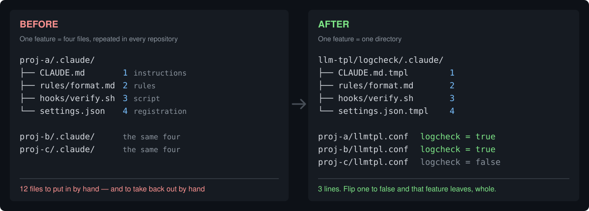

# llmtpl

[](https://github.com/ryokwkm/llmtpl/actions/workflows/ci.yml)
[](https://github.com/ryokwkm/llmtpl/releases)
[](LICENSE)

**English** | [日本語](README.ja.md)

Turn AI agent config features on and off, one line at a time.



llmtpl manages the config files an **AI coding agent** reads: the instructions file, the long rules it
points at, hook scripts, and the settings that register them. It keeps everything one feature needs in
**one directory**, and every repository turns that feature on or off with a single line. Every example
here uses Claude Code, but nothing depends on that layout — `AGENTS.md`, `.cursor/`, and `.github/`
travel by the same rules.

```ini
logcheck = true
```

That line brings in the instructions, the rules, the script, and the registration. Flip it to `false`
and all of it leaves — nothing to undo by hand.

## Install

```sh
brew install ryokwkm/tap/llmtpl   # macOS only — the tap ships a cask
```

On Linux, take `llmtpl_<version>_linux_amd64.tar.gz` (or `_arm64`) from
[Releases](https://github.com/ryokwkm/llmtpl/releases), or use Go:

```sh
go install github.com/ryokwkm/llmtpl@latest   # needs Go 1.24+
```

From source, `make build` writes `./llmtpl`. `make install` puts it in `~/.local/bin` and installs zsh
completions (macOS/zsh assumed). `llmtpl completion zsh|bash|fish` prints them individually.

## Try it

Everything below runs as written, and the output is real. This README covers getting started; the
details of the spec, and the reasoning behind them, are in [docs/reference.md](docs/reference.md).

### Put one feature in one directory

A one-feature directory is a **bundle**; a project that receives config is a **target**. Those are the
only two words. The directory name — `logcheck` — becomes the flag name, so creating a directory
creates a flag; there is no registry to update.

```
demo/
├── llm-tpl/                        ← where bundles live
│   └── logcheck/                   ← the directory name IS the flag name
│       └── .claude/                   inside, the same shape as the receiving side
│           ├── CLAUDE.md.tmpl      1. instructions
│           ├── rules/format.md     2. rules
│           ├── hooks/verify.sh     3. script
│           └── settings.json.tmpl  4. hook registration
└── proj/                           ← the project that receives config
    ├── llmtpl.conf                    logcheck = true
    └── .claude/
        ├── CLAUDE.md.tmpl             proj's own instructions (the base fragments land in)
        └── settings.json.tmpl         proj's own settings
```

<details>
<summary><b>The commands that build this tree</b> — copy-paste them, or just read on</summary>

```sh
mkdir -p demo/llm-tpl/logcheck/.claude/rules demo/llm-tpl/logcheck/.claude/hooks demo/proj/.claude
cd demo

# Bundle side — 1. instructions (a fragment; the .tmpl extension is required, the content is plain Markdown)
cat > llm-tpl/logcheck/.claude/CLAUDE.md.tmpl <<'EOF'

## Work log checks

- Verify the format of `log/` when you finish a task. The rules are in `.claude/rules/logcheck/format.md`.
- To check by hand, run `.claude/hooks/verify.sh`.
EOF

# 2. rules and 3. script (distributed as-is, so the content can be anything)
echo '- Every line starts with a timestamp.' > llm-tpl/logcheck/.claude/rules/format.md
printf '#!/bin/sh\necho ok\n' > llm-tpl/logcheck/.claude/hooks/verify.sh

# 4. hook registration (a fragment deep-merged into settings.json)
cat > llm-tpl/logcheck/.claude/settings.json.tmpl <<'EOF'
{
  "hooks": {
    "Stop": [
      { "hooks": [{ "type": "command", "command": "$CLAUDE_PROJECT_DIR/.claude/hooks/verify.sh" }] }
    ]
  }
}
EOF

# Target side — one line of conf, plus two bases holding only what is specific to proj
printf 'logcheck = true\n' > proj/llmtpl.conf
printf '# Instructions for proj\n\n- Write it in Go.\n' > proj/.claude/CLAUDE.md.tmpl
printf '{"model": "opus"}\n' > proj/.claude/settings.json.tmpl
```

</details>

### Turn it on

```console
$ cd proj && llmtpl apply

bundle root: /path/to/demo/llm-tpl (found by walking up)
▸ proj  [ON: logcheck]
  ✅ generated .claude/CLAUDE.md
  ✅ generated .claude/settings.json
  🔗 linked .claude/hooks/verify.sh -> ../../../llm-tpl/logcheck/.claude/hooks/verify.sh
  🔗 linked .claude/rules/logcheck -> ../../../llm-tpl/logcheck/.claude/rules
```

- Run it **inside your own project** — the default is the current directory and everything under it
- The bundle directory is **found by walking up**, so you never pass a path
- `llmtpl apply --dry-run` shows the plan without writing

All four landed. The generated `CLAUDE.md` is the base with the bundle's instructions appended
(line 1 is a marker llmtpl adds):

```markdown
<!-- GENERATED — do not edit directly. Source: proj/.claude/CLAUDE.md.tmpl (edit the source, then run llmtpl apply) -->
# Instructions for proj

- Write it in Go.

## Work log checks

- Verify the format of `log/` when you finish a task. The rules are in `.claude/rules/logcheck/format.md`.
- To check by hand, run `.claude/hooks/verify.sh`.
```

In `settings.json`, the target's own `model` and the bundle's `hooks` merge into one document.
**Resolving overlapping keys is the part a symlink cannot do.**

```json
{
  "hooks": {
    "Stop": [
      {
        "hooks": [
          {
            "command": "$CLAUDE_PROJECT_DIR/.claude/hooks/verify.sh",
            "type": "command"
          }
        ]
      }
    ]
  },
  "model": "opus"
}
```

`rules/` and `hooks/` are relative symlinks. One copy lives in the bundle; nothing is duplicated.

So one directory reached the target **three different ways**: `.md` concatenated as prose, `.json`
merged as structure, directories and scripts symlinked. **The extension alone decides** — llmtpl does
not know any of these filenames.

### Turn it off

Change `llmtpl.conf` to `logcheck = false` and run again.

```console
$ llmtpl apply

bundle root: /path/to/demo/llm-tpl (found by walking up)
▸ proj  [ON: (none)]
  ✅ generated .claude/CLAUDE.md
  ✅ generated .claude/settings.json
  ✂️  unlinked .claude/hooks/verify.sh
  ✂️  unlinked .claude/rules/logcheck
```

Exactly what was added is subtracted. The "Work log checks" section leaves `CLAUDE.md`,
`settings.json` returns to `{"model": "opus"}`, and both symlinks come out. **Everything specific to
the project stays.**


Undoing four places by hand became **one line**.

## Adding it to a repository you already have

If the repository already has `CLAUDE.md` and `settings.json`, it takes five steps.

1. **Rename** `.claude/CLAUDE.md` → `.claude/CLAUDE.md.tmpl` and `.claude/settings.json` → `.claude/settings.json.tmpl`
2. Put `llmtpl.conf` at the **repository root** with a line per bundle you want (that file is what marks a target)
3. `llmtpl apply --dry-run` to see the plan
4. `llmtpl apply` if it looks right
5. Add the new symlinks to `.gitignore` — committed symlinks become dangling for anyone who clones without llmtpl

Add `.archive/` and `.llmtpl-state.json` to `.gitignore` too. The **generated files themselves are
worth committing**: flipping a flag becomes a reviewable diff, and you can run `llmtpl check` in CI.

Backing out takes two steps, and neither deletes anything by hand.

1. Set every flag to `false` and `apply` — all symlinks come out, and each body returns to what is
   specific to the project
2. `mv .claude/CLAUDE.md.tmpl .claude/CLAUDE.md` — the source overwrites the generated file, marker
   and all

## Why: one feature, four places

Say you add "check the work log format automatically." Without llmtpl it lands in four separate files.
(Those paths are Claude Code's. Every agent has its own set, and llmtpl does not care which.)

Putting those four in place is a few lines each. **Taking them back out is the problem** — you undo
four separate files by hand, and missing one breaks things quietly:

- Leave only the instructions and **the agent follows a rule that no longer exists**
- Leave only the script and its registration and **a check nobody reads runs forever**

Then do that per repository. It falls apart once you are holding features × repositories in your head.

The picture at the top is that trade: the four files live once, and the per-repository decision
shrinks to one line each.

Whatever you put in a bundle lands at the same relative place in the target, which is what makes the
same rules work for any agent's layout. The author runs it daily across several repositories with
fourteen bundles.

## Isn't this just Stow?

Three things had to happen above:

1. **Distribute and remove whole files and directories** (`hooks/verify.sh`, `rules/`)
2. **Insert and remove a few lines inside one file** (`CLAUDE.md`)
3. **Merge different keys of one JSON from separate sources** — the bundle's `hooks` and the
   project's own `model` in `settings.json` (several features writing to it work the same way)

GNU Stow does 1. only, and never goes below the file. chezmoi reaches 2., but its unit is "one source
→ one destination," so the branching collects on the destination file rather than on the feature.
llmtpl folds things onto the feature and does all three.

## Across many repositories

The demo above was self-contained, but in practice you keep **one bundle directory and let every
repository draw from it**. All a repository gains is `llmtpl.conf` and the base `.tmpl` files.

```console
$ cd ~/src && llmtpl apply proj-a proj-b proj-c
```

The links are relative, so they resolve on a machine with a different home directory or username.
`status` shows what is on where.

```console
$ llmtpl status proj-a proj-b proj-c

3 targets
bundle root: /Users/me/src/llm-tpl (found by walking up)
target  audit  logcheck
proj-a  ON     ON
proj-b  -      ON
proj-c  ON     -
```

This pays off once it multiplies. Somewhere around three features across five repositories, the
table stops fitting in your head.

## What lands where

**Bundle** — one directory at `<bundle root>/<flag name>/`, holding one feature. **Its inside has the
same shape as a project.** What you put there lands at the same place.

**Target** — the **project root** that receives config. The only condition is **having an
`llmtpl.conf`**. Generated files and symlinks appear under it. One repository may hold several.

| Put in a bundle | What happens in the target |
|---|---|
| `*.md.tmpl` | inserted into the generated file at the same relative path (at the end by default) |
| `*.json.tmpl` | deep-merged into the generated file at the same relative path |
| `.claude/rules/` | the **whole directory** symlinked to `.claude/rules/<flag name>` |
| any other directory (`skills/`, `hooks/`, under `.cursor/`, …) | symlinked **entry by entry** |

A bundle's `.claude/` reaching the project's `.claude/` is just a consequence of "it lands at the same
place." Put `AGENTS.md.tmpl` at the bundle root and you get `<target>/AGENTS.md`; add `.cursor/` and it
reaches `.cursor/` by the same rule. llmtpl knows the name `.claude` for exactly two reasons: it is a
layer scanned by default, and `.claude/rules/` is the one directory folded whole. Config for tools
other than Claude Code travels the same four ways.

**A fragment lands only if the target has a `*.tmpl` at the same relative path.** If it does not, the
fragment goes nowhere and `apply` / `check` say so in one line (without counting it as a difference).
To receive it, add an empty `CLAUDE.md.tmpl`.

Line 1 of every generated file carries a `<!-- GENERATED ... -->` marker, and llmtpl only overwrites
or deletes **what it wrote or linked itself**. An existing hand-written file is copied to `.archive/`
before being overwritten — nothing is destroyed silently.

Choosing **where** a fragment lands (slots), template syntax for conditionals and shared partials,
defaults shared by every repository (`defaults.conf`), merge precedence, and how ownership is decided
are all in the [reference](docs/reference.md). None of them are needed to get going.

## Commands

| Command | What it does |
|---|---|
| `llmtpl` | interactive mode — pick a target, tick its flags, apply (see below). Prints the help instead when it is not run from a terminal |
| `llmtpl apply [dir...]` | generate and link (defaults to the current directory and below) |
| `llmtpl apply --dry-run` | print what would be written and removed, then stop |
| `llmtpl check [dir...]` | check that generated files are current. **Exit 2 on differences** (for CI and hooks) |
| `llmtpl status [dir...]` | a target × flag matrix of effective values |
| `llmtpl bundles` | list bundles, each with its description (from an optional `bundle.conf` inside it) |

`llmtpl <cmd> --help` is authoritative for options. Exit codes: **0 fine, 1 error, 2 `check` found
differences, 130 the interactive mode was aborted**.

With no arguments it works in two stages: with a single target below the current directory it goes
straight to the flag checkboxes; with several it lets you pick a target from a list (with a summary
of the flags currently ON), edit its flags, apply, and return to the list. It rewrites **only the
values of the lines it has to touch**, so the comments around your flags survive. Details are in
the [reference](docs/reference.md#interactive-mode).

If the bundle directory does not sit somewhere above your projects, name its path with the reserved
`bundle_root` key in `llmtpl.conf`. Search scope, the full resolution order, and the details of
`bundle_root` are in the [reference](docs/reference.md).

## Before you rely on it

- **macOS and Linux only** — creating symlinks is required; Windows is not supported
- **Everything in a `.tmpl` is evaluated as a Go template.** A line containing `{{ }}` (documenting
  GitHub Actions' `${{ }}`, say) stops `apply` with an error. Nothing is silently dropped, and
  `--dry-run` shows it. To keep a literal `{{`, write `{{"{{"}}`
- **Hand edits to a generated file are lost on the next apply** (they are not archived). Edit the
  `*.tmpl` source instead
- **A fresh clone needs one `llmtpl apply`.** The symlinks are gitignored, so a teammate gets the
  hook registration without the script — and Claude Code then **fails silently** (it answers, exits
  0, and shows only a collapsed notification). Keeping `llm-tpl/` inside the repository makes this
  one step

The archiving mechanism, the cost of generating into `~/.claude`, the full list of what is not
guaranteed, the constraints, and what happens to a teammate who clones are all in the
[reference](docs/reference.md).

## Development

```sh
make test    # go test ./...
make vet
make fmt
```

`internal/` is pure pieces (`render`, `mergejson`, `fileout`, `link`, `confedit`) plus an
orchestrator (`apply`) that binds them; only presentation and exit codes live in `main`. The
interactive mode keeps its TUI dependency in `interactive.go` alone and takes the three prompts as
functions, so the whole flow is testable without a terminal. Tests are fixture-based, and
`testdata/golden/` pins generated output byte for byte against realistic input.

## License

Apache-2.0 ([LICENSE](LICENSE)). **What it generates is yours** — this license covers llmtpl itself only.
